# Algorithms & Scoring Reference

All logic described here lives in `shared/analysis_engine.py` and `services/calculation_service.py`.

---

## 1. Per-Ticker Metrics Pipeline

Each ticker goes through a single pipeline. Minimum 60 trading days of price history required; tickers with fewer are silently skipped.


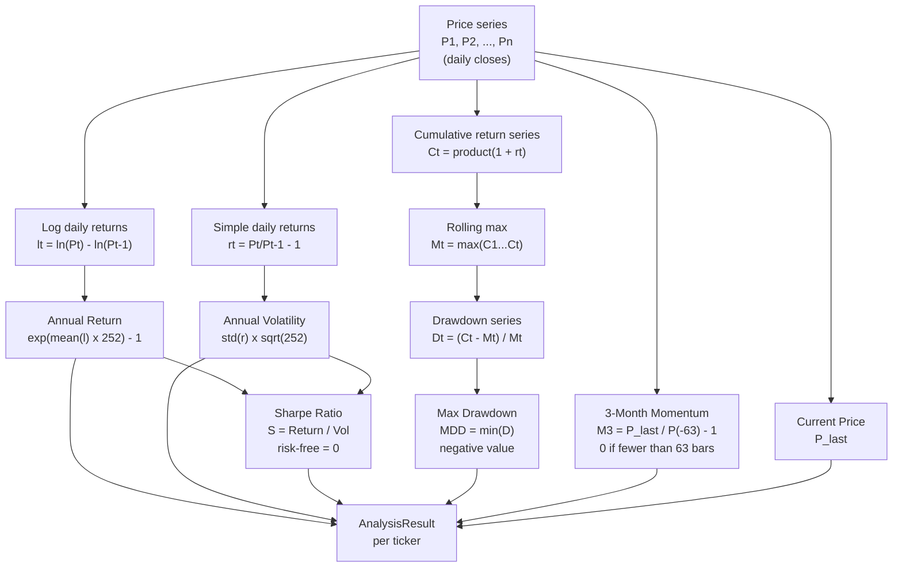

### Formulas

| Metric | Formula | Notes |
|---|---|---|
| **Annual Return** | `exp(mean(log_returns) × 252) − 1` | Log-return method; more accurate than arithmetic mean for long series |
| **Annual Volatility** | `std(simple_returns) × √252` | Simple returns used for vol — consistent with PyPortfolioOpt convention |
| **Sharpe Ratio** | `Annual_Return / Annual_Volatility` | Risk-free rate = 0 at this stage; applied in optimization separately |
| **Max Drawdown** | `min((Cₜ − rolling_max(C)) / rolling_max(C))` | Always ≤ 0; −0.30 means a 30% peak-to-trough loss |
| **3-Month Momentum** | `P_last / P_{−63} − 1` | 63 trading days ≈ 3 calendar months |

---

## 2. Composite Scoring


After all tickers are analysed, scores are computed **across the batch** — not per ticker in isolation. This makes every score relative to the current universe.

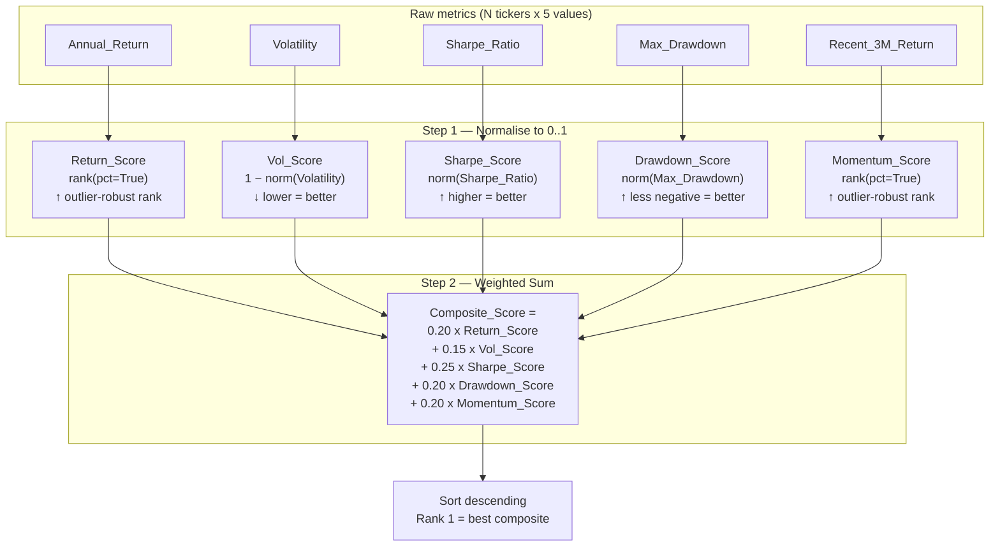

### Weight Rationale

| Component | Weight | Direction | Reasoning |
|---|---|---|---|
| Sharpe Ratio | **25 %** | ↑ | Primary risk-adjusted signal; unchanged — it is the most information-dense single metric |
| Annual Return | **20 %** | ↑ | Raw return objective; reduced from 25% to limit double-counting with Sharpe |
| Max Drawdown | **20 %** | ↑ | Tail-risk protection; increased to give independent tail-risk factor more voice |
| 3M Momentum | **20 %** | ↑ | Recency signal; fully independent of Sharpe — increased weight reflects this |
| Volatility | **15 %** | ↓ | Penalise pure volatility; reduced from 20% because Sharpe already incorporates vol |

### Normalisation Detail

Two normalisation methods are used depending on the metric's tail behaviour:

**Percentile rank** — `Series.rank(pct=True)` — applied to **Annual_Return** and **3M_Momentum**:
- Assigns each ticker its rank position as a fraction of the batch size (0 < score ≤ 1)
- Outlier-robust: one extreme value (e.g., NVDA +180% annual return) does not compress all other scores to near zero
- Direction is implicit: higher rank = higher score

**Min-max normalisation** — applied to **Volatility**, **Sharpe_Ratio**, and **Max_Drawdown**:
```
norm(x) = (x − min(x)) / (max(x) − min(x))
```
- If all values in a metric are identical (`range = 0`), every ticker receives `0.5`
- Inverse for Volatility: `1 − norm(x)` so that lower volatility scores higher
- Max_Drawdown is already negative (e.g., −0.30 for a 30% loss); `norm` without inversion correctly maps the least negative value (best) → 1.0 and the most negative (worst) → 0.0
- Scores are **not** stable across runs — adding or removing tickers from the batch shifts every score

---

## 3. Delta Price Sync Algorithm

`PriceSyncService._delta_sync()` — the highest-risk function in the pipeline. A merge bug here produces wrong analysis results silently.


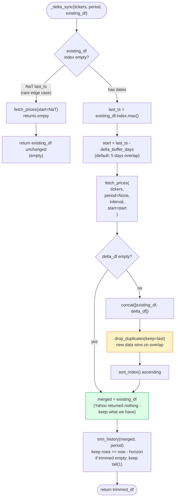

### Key Design Choices

| Choice | Why |
|---|---|
| **5-day overlap buffer** | Guards against late-arriving data, weekend/holiday gaps, and Yahoo's inconsistent close dates |
| **`keep='last'` on duplicates** | New delta data wins over cached data for overlapping dates — ensures corrections and corporate actions propagate |
| **Return existing on empty delta** | Silent Yahoo outages do not corrupt the cache |
| **Trim after merge** | The combined frame may be larger than the period horizon; trim ensures consistent retention windows |

---

## 4. Portfolio Optimisation Pipeline


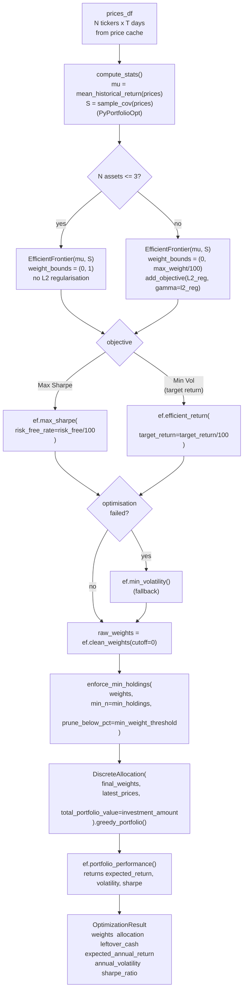

### enforce_min_holdings Detail


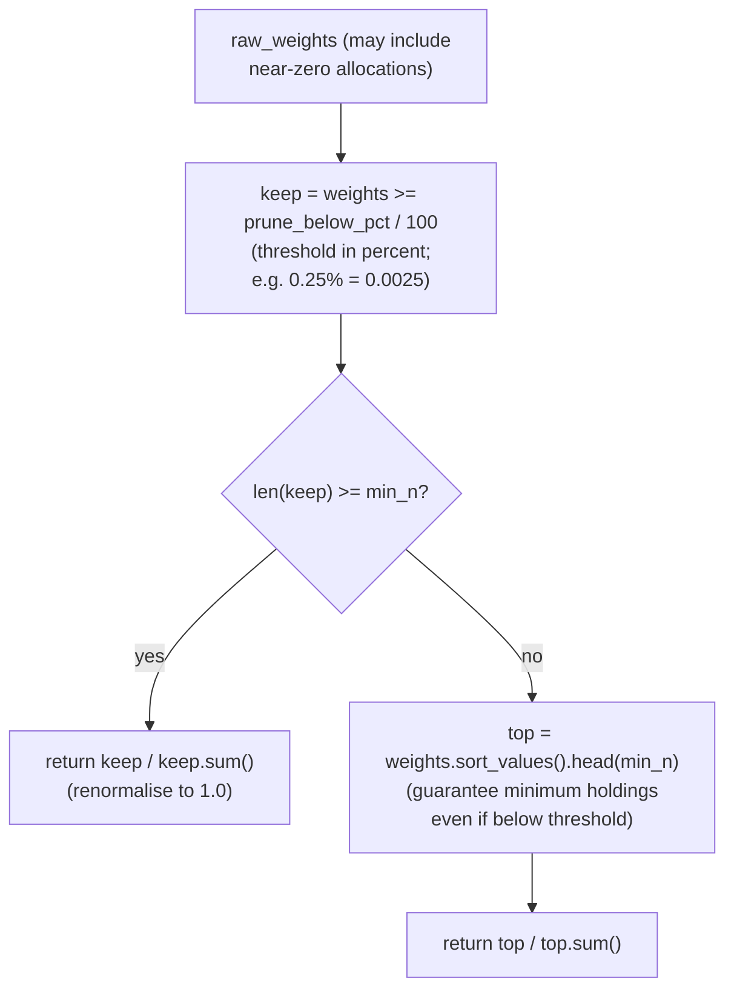

### Objective Comparison

| Objective | Solver call | When to use |
|---|---|---|
| **Max Sharpe** | `ef.max_sharpe(risk_free_rate)` | Default — maximises return per unit of risk |
| **Min Volatility (target return)** | `ef.efficient_return(target_return)` | When a specific return target is required with minimum risk |
| **Fallback** | `ef.min_volatility()` | Auto-triggered when primary optimisation fails (infeasible constraints) |

### L2 Regularisation

When `l2_reg > 0`, an L2 penalty `γ × ‖w‖²` is added to the objective. This pushes the solver toward more equal-weight solutions, reducing concentration in a single asset. L2 is disabled automatically when N ≤ 3 (too few assets for regularisation to be meaningful).

---

## 5. Column Normalisation (Cache Compatibility)

`standardize_analysis_columns()` is applied every time an analysis Parquet is loaded. It bridges the legacy `snake_case` schema (written by older sync jobs) and the current `Title_Case` schema expected by the UI.

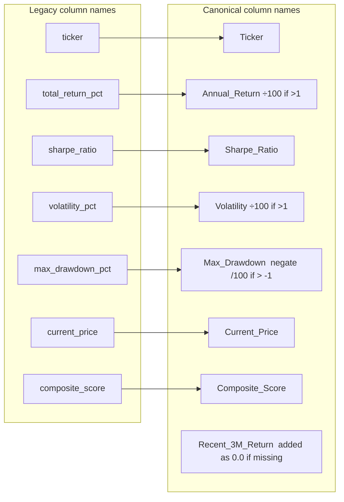

**Unit guards:** If `Annual_Return > 1` the value is divided by 100 (percentage stored as `15.3` → normalised to `0.153`). Same for Volatility. Max_Drawdown is negated and divided by 100 if it appears as a positive percentage.

---

## 6. Algorithm Interaction Summary


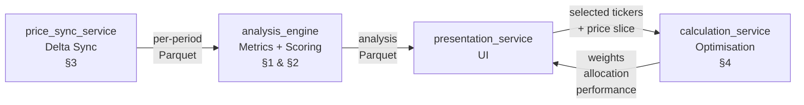

The pipeline is strictly unidirectional:

1. **Price sync** produces raw OHLC data → Parquet
2. **Analysis engine** consumes price Parquet → analysis Parquet (metrics + composite score)
3. **UI** reads analysis Parquet to let the analyst select tickers
4. **Optimiser** consumes the selected price slice → portfolio weights and share allocation
