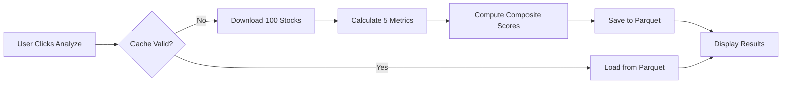
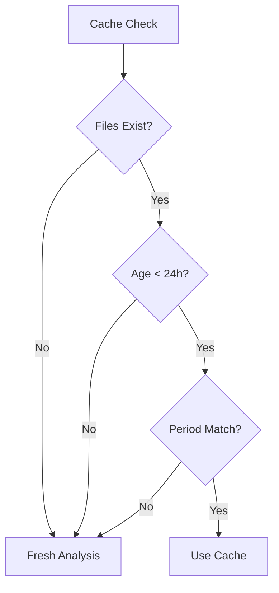

# Data Storage Architecture - S&P 500 Portfolio Optimizer

## Overview

The S&P 500 Portfolio Optimizer uses a **hybrid data storage approach** that balances performance, data freshness, and resource efficiency. The system distinguishes between computationally expensive analysis results (which are cached) and real-time price data (which is always fetched fresh).

## Storage Components

### 1. **Persistent File Storage** 💾

#### Primary Data Files
```
sp500_data/
├── sp500_analysis.parquet     # 24KB - Analysis results for 100 stocks
└── metadata.parquet           # 4KB  - Cache metadata and timestamps
```

#### File Details

**A. Analysis Cache (`sp500_analysis.parquet`)**
- **Size**: 24KB (100 stocks × ~240 bytes per stock)
- **Format**: Apache Parquet (columnar, compressed)
- **Content**:
  - Ticker symbols
  - Annual returns, volatility, Sharpe ratios  
  - Maximum drawdown, 3-month momentum
  - Composite scores and rankings
  - Analysis timestamps and periods
- **Purpose**: Avoid re-analyzing 100 stocks (5-7 minute process)
- **Validity**: 24 hours

**B. Metadata Cache (`metadata.parquet`)**  
- **Size**: 4KB (single-row metadata table)
- **Format**: Apache Parquet
- **Content**:
  ```python
  {
      'last_updated': datetime,
      'period': '1y'|'2y'|'3y'|'6M',
      'num_stocks': 100,
      'version': '1.0'
  }
  ```
- **Purpose**: Track cache validity and configuration

### 2. **In-Memory Caching** 🧠

#### Streamlit Session Cache
- **Mechanism**: `@st.cache_data` decorator
- **Scope**: Per-user session only
- **Content**: Real-time price data for portfolio optimization
- **Duration**: Until page refresh or session timeout
- **Purpose**: Avoid re-downloading same price data during UI interactions

#### Application Memory
- **Temporary Variables**: DataFrames during processing
- **User Selections**: Streamlit session state
- **UI State**: Form inputs, button states
- **Not Persistent**: Lost on application restart

### 3. **External Data Sources** 🌐

#### Yahoo Finance (via yfinance)
- **Primary Source**: All historical price data
- **API**: Free, rate-limited
- **Data Types**: OHLCV (Open, High, Low, Close, Volume)
- **Timeframes**: 6M, 1Y, 2Y, 3Y, 5Y
- **Intervals**: Daily, Weekly, Monthly
- **Reliability**: 99%+ uptime, occasional delays

## Data Flow Architecture

### 1. **S&P 500 Analysis Pipeline**



**Code Location**: `app.py:288-408`, `services/data_service.py:95-200`

### 2. **Portfolio Optimization Pipeline**


**Code Location**: `app.py:544-600`, `app.py:787-791`

### 3. **Cache Management**



## Technical Implementation

### 1. **File Operations** (`app.py:222-283`)

#### Save Analysis Data
```python
def save_analysis_data(df: pd.DataFrame, period: str):
    ensure_data_directory()
    
    # Add metadata columns
    df = df.copy()
    df['analysis_timestamp'] = datetime.now()
    df['analysis_period'] = period
    
    # Save main data
    df.to_parquet(ANALYSIS_FILE, index=False)
    
    # Save metadata
    metadata = pd.DataFrame({
        'last_updated': [datetime.now()],
        'period': [period],
        'num_stocks': [len(df)],
        'version': ['1.0']
    })
    metadata.to_parquet(METADATA_FILE, index=False)
```

#### Load Analysis Data
```python
def load_analysis_data() -> Tuple[pd.DataFrame, dict]:
    if not ANALYSIS_FILE.exists() or not METADATA_FILE.exists():
        return pd.DataFrame(), {}
    
    df = pd.read_parquet(ANALYSIS_FILE)
    metadata_df = pd.read_parquet(METADATA_FILE)
    metadata = metadata_df.iloc[0].to_dict()
    
    return df, metadata
```

### 2. **Cache Validation** (`app.py:267-283`)

```python
def is_data_stale(metadata: dict, max_age_hours: int = 24) -> bool:
    if not metadata:
        return True
    
    last_updated = metadata.get('last_updated')
    if isinstance(last_updated, str):
        last_updated = pd.to_datetime(last_updated)
    
    age = datetime.now() - last_updated
    return age > timedelta(hours=max_age_hours)
```

### 3. **In-Memory Caching** (`app.py:413-526`)

```python
@st.cache_data(show_spinner=True)
def load_prices(tickers: List[str], period: str, interval: str) -> pd.DataFrame:
    # Streamlit automatically handles caching based on parameters
    # Cache key: hash(tickers, period, interval)
    
    frames = []
    for batch in batches(tickers, batch_size=5):
        df = yf.download(batch, period=period, interval=interval)
        frames.append(process_batch(df))
    
    return pd.concat(frames, axis=1)
```

## Storage Patterns

### 1. **Analysis Results: Persistent Cache**
- **Pattern**: Write-through cache with TTL
- **Reason**: Expensive computation (5-7 minutes)
- **Trade-off**: Disk space vs. computation time
- **Invalidation**: Time-based (24 hours) + manual force refresh

### 2. **Price Data: Session Cache**  
- **Pattern**: Memory-only with parameter-based keys
- **Reason**: Fast API calls but rate-limited
- **Trade-off**: Memory usage vs. API calls
- **Invalidation**: Session end or parameter change

### 3. **User Selections: Session State**
- **Pattern**: Temporary key-value store
- **Reason**: UI state persistence during session
- **Storage**: Streamlit session state dictionary
- **Lifetime**: Single user session

## Performance Characteristics

### 1. **Cache Hit Performance**
- **Analysis Results**: ~50ms (Parquet read)
- **Price Data**: ~1ms (memory access)
- **UI State**: ~0.1ms (dictionary lookup)

### 2. **Cache Miss Performance**  
- **Analysis Results**: 5-7 minutes (100 API calls + computation)
- **Price Data**: 1-5 seconds (API call + processing)
- **UI State**: Immediate (new session)

### 3. **Storage Efficiency**
- **Compression Ratio**: ~10:1 (Parquet vs CSV)
- **Space Usage**: 28KB for 100 stocks of analysis data
- **Memory Footprint**: 10-50MB for active price data

## Scalability Considerations

### 1. **Current Limitations**
- **Single-node**: Local filesystem storage
- **Session isolation**: No shared cache between users
- **Manual invalidation**: No automatic data refresh
- **Rate limits**: Yahoo Finance API constraints

### 2. **Production Enhancements**

#### Database Integration
```python
# Replace Parquet files with PostgreSQL/MongoDB
class DatabaseStorage:
    def save_analysis_data(self, df: pd.DataFrame, period: str):
        connection.execute(
            "INSERT INTO analysis_cache (ticker, metrics, timestamp, period) VALUES ..."
        )
    
    def load_analysis_data(self, period: str) -> pd.DataFrame:
        return pd.read_sql(
            "SELECT * FROM analysis_cache WHERE period = ? AND age < interval '24 hours'",
            connection
        )
```

#### Distributed Caching
```python
# Redis for shared session cache
import redis
r = redis.Redis()

@functools.lru_cache
def load_prices_cached(tickers: tuple, period: str) -> pd.DataFrame:
    cache_key = f"prices:{hash(tickers)}:{period}"
    cached = r.get(cache_key)
    
    if cached:
        return pickle.loads(cached)
    
    data = download_fresh_prices(tickers, period)
    r.setex(cache_key, 3600, pickle.dumps(data))  # 1 hour TTL
    return data
```

#### Background Refresh
```python
# Automatic cache warming
import schedule

def refresh_analysis_cache():
    for period in ['6M', '1Y', '2Y', '3Y']:
        analyze_sp500_stocks(SP500_SAMPLE, period, force_refresh=True)

schedule.every().day.at("06:00").do(refresh_analysis_cache)
```

## Data Governance

### 1. **Data Quality**
- **Validation**: Check for missing tickers, invalid metrics
- **Completeness**: Ensure all 100 stocks analyzed
- **Consistency**: Verify period alignment across cache files

### 2. **Data Freshness**
- **Analysis Data**: 24-hour TTL with manual override
- **Price Data**: Always fresh from Yahoo Finance
- **Metadata**: Updated with each analysis run

### 3. **Error Handling**
- **Missing Files**: Graceful fallback to fresh analysis
- **Corrupt Data**: Exception handling with cache invalidation  
- **API Failures**: Retry logic with exponential backoff

### 4. **Monitoring**
- **Cache Hit Rate**: Track analysis cache effectiveness
- **API Usage**: Monitor Yahoo Finance rate limits
- **Error Rates**: Track failed downloads and analyses
- **Performance**: Monitor cache read/write times

## Security Considerations

### 1. **Data Sensitivity**
- **Public Data**: All stock prices are publicly available
- **No PII**: No personally identifiable information stored
- **Local Storage**: Files remain on local filesystem

### 2. **Access Control**
- **File Permissions**: Standard OS-level protections
- **API Keys**: Not required for Yahoo Finance
- **Session Isolation**: Streamlit handles user separation

### 3. **Data Integrity**
- **File Validation**: Parquet format includes checksums
- **Timestamp Verification**: Prevent cache poisoning
- **Input Sanitization**: Validate ticker symbols

This architecture provides a robust foundation for the portfolio optimizer while maintaining the flexibility to scale to production environments with enhanced caching, persistence, and monitoring capabilities.